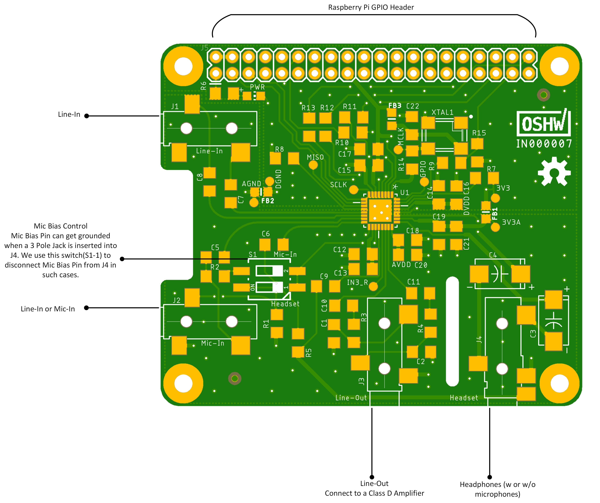
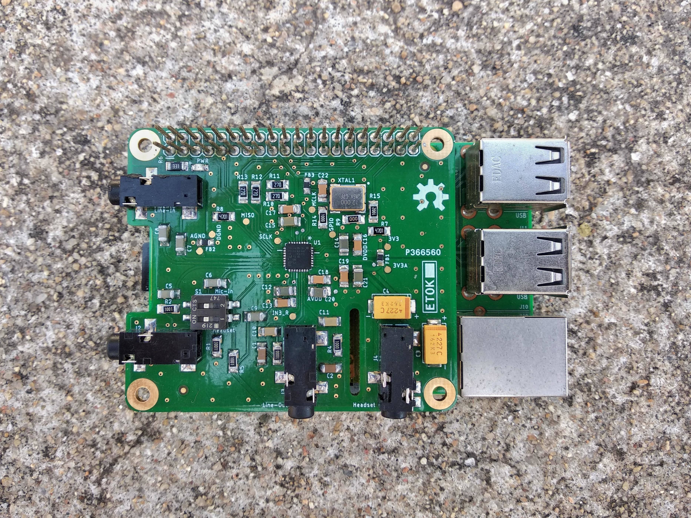
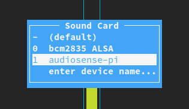
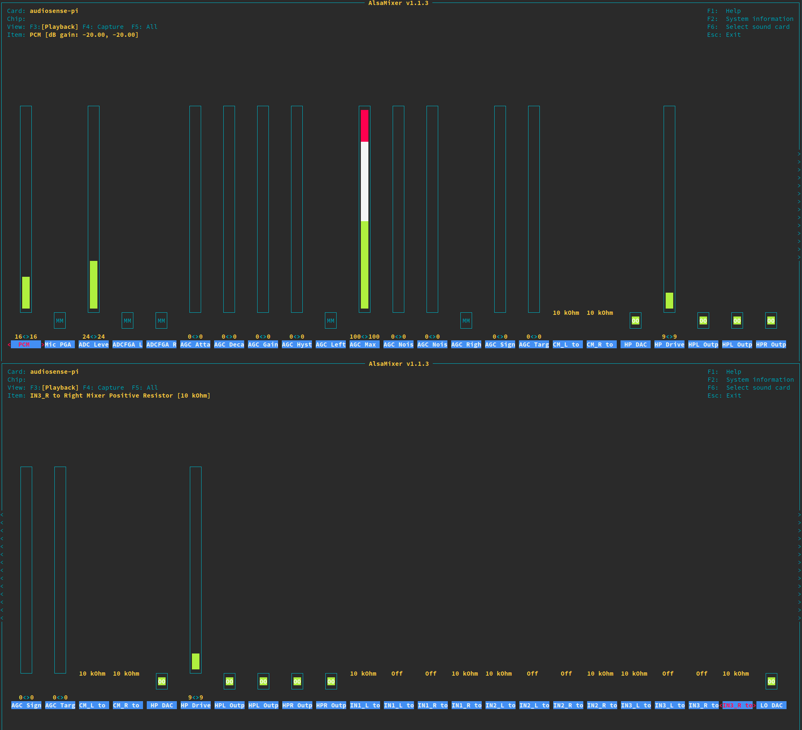

## AudioSense-Pi


**AudioSense-Pi** is a RPi HAT based on a TI's stereo codec.  
It is **Open Source Harwdare Association (OSHWA)** certified with **_UID - IN000007_**

This hardware provides audio input capabilities to the RPi.   
The codec connects to the RPi's SoC through the I2S Bus.

_The codec chosen, allows interfacing **multiple audio I/O** to the RPi._   

**Multiple I/O?** _Yes!_   
The following devices can be connected through a 3.5mm jack
1. Line-In: Plain old audio in from mobile phones, PCs, etc.,
2. Mic-In: Connect a microphone
3. Line-Out: Connect the output to a speaker
4. Headphones: Connect a Headphone w or w/o microphones

**Simultaneous Inputs?** _Yes!_    
It supports the following combinations
1. Two stereo Line-Inputs and a microphone
2. One stereo Line-Input and two microphones
3. Two stereo Line-Inputs, a microphone and one mono line-input (with h/w hack)
4. One stereo Line-Input, two microphones and one mono line-input (with h/w hack)

**Simultaneous Outputs?** _Yes!_   
Audio output can be routed to the headphones or speakers (with additional hardware)

#### Hardware overview       


#### Software overview   
Using the ALSA System on Chip (ASoC) layer we write a machine driver for the HAT.   
With the following changes a new sound card by the name `audiosense-pi` will appear
1. A device tree overlay is added for hardware configuration.
2. Changes to the configuration file (config.txt).
3. ASoC machine driver, makefile and kconfig changes
4. Minimal changes to the ASoC codec driver to handle deprecated APIs

## Getting started with AudioSense-Pi

#### Fab
1. Order the [BOM](./hardware/AudioSense-Pi_BOM.ods)
2. Send the [gerber files](./hardware/audiosense-pi-gerber.zip) to your nearest fab house
3. Assemble the board, it should look something like this..

Assembled Board    


#### Preparing the SD card

We have three ways to setup audiosense
1. Get the [prebuilt images](https://drive.google.com/file/d/10sPdlaTlowZFA2HO4iOQT1hiyIX3uXNR/view?usp=sharing), flash it into a SD card, fly away!
2. Stay with the existing image you have, build the kernel yourself and flash only the kernel image
    * Pull the raspberry pi [kernel source](https://github.com/raspberrypi/linux.git)
    * Use [this](https://github.com/b-ak/helper-scripts/blob/master/rpi3-kernel-builder.sh) script to build and flash the kernel image to the SD card
    * Edit/add the following lines to the `config.txt` in the boot partiton of the SD card
    ```
        # Uncomment some or all of these to enable the optional hardware interfaces
        dtparam=i2c_arm=on
        dtparam=i2s=on
        dtparam=spi=on
        
        # Uncomment this to enable the lirc-rpi module
        #dtoverlay=lirc-rpi
        
        # Additional overlays and parameters are documented /boot/overlays/README
        dtoverlay=audiosense-pi

        # Enable audio (loads snd_bcm2835)
        dtparam=audio=on
    ```    
    * Boot the pi, run the command `aplay -l` you should see a new soundcard `audiosense-pi`
3. Get a kernel image that you want, merge the patches manually, build and flash the kernel image (*for advanced kernel developers*)
    * Clone the kernel sources you want
    * Apply the patches in the [software directory](./software) (`git am` might not work owing to the large number of changes among the trees)
    * Use the script in step 2, apply the `config.txt` changes and boot the pi

#### Configuring the soundcard
1. Open terminal, type in `alsamixer`. Hit `F6` and select `audiosense-pi` from the list of soundcards
	Soundcard selection    
	
2. Soundcard widgets and control settings    
	
3. Plug in an audio-input to the board, a headphones and run `arecord -D hw:1 -c 2 -r 48000 -f S16_LE | aplay -D hw:1`
4. If you did everything right, you will be listening to your favourite song ;)

## License Information  

*Hardware* licensed under the _CERN Open Hardware License version 1.2_   
*Software* licensed under the _GNU GPLv2_   
*Documentation* licensed under _CC0 1.0 Universal_   


