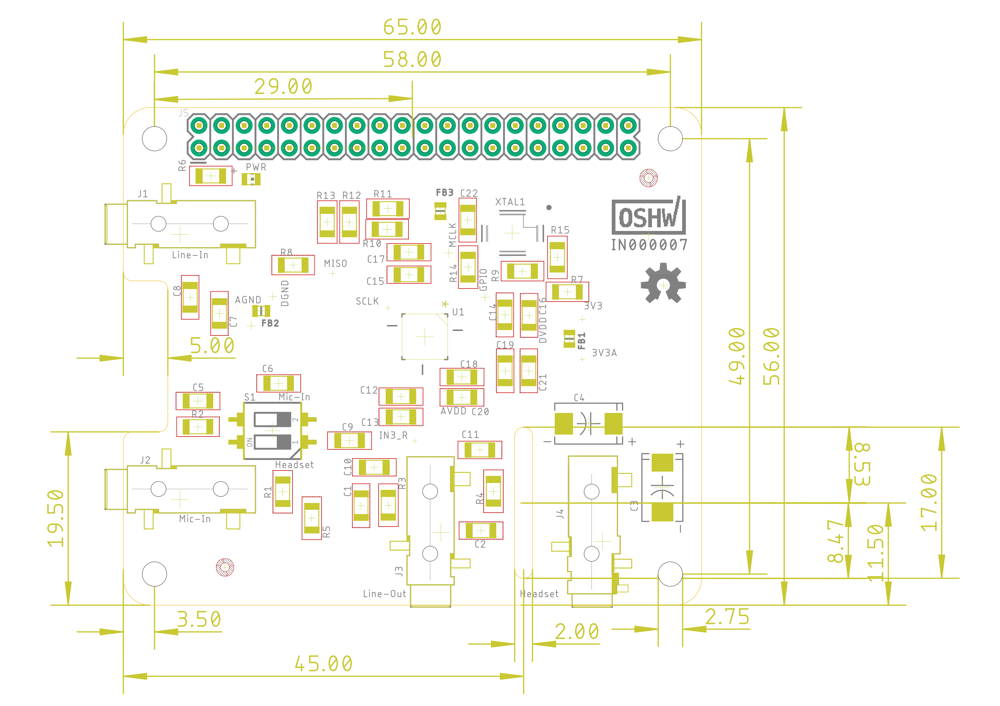

## AudioSense-Pi Hardware 

**Schematics**       

**Board**       

**PCB Top**       

**PCB Bottom**       

**Assembly**      

## License Information  

*Hardware* licensed under the _CERN Open Hardware License version 1.2_   
*Software* licensed under the _GNU GPLv2_   
*Documentation* licensed under _CC0 1.0 Universal_   

